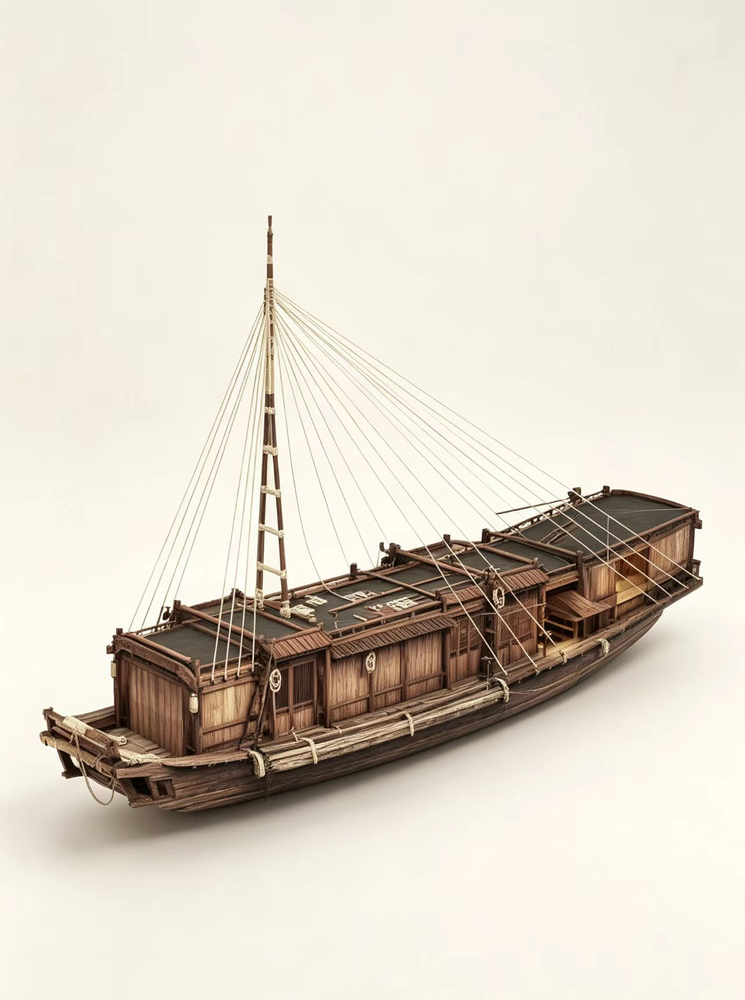
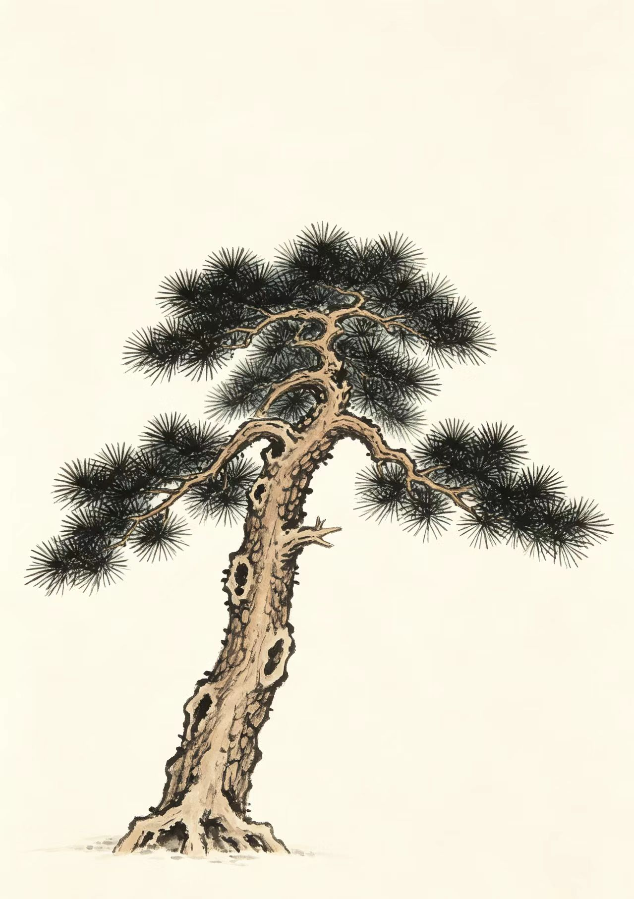
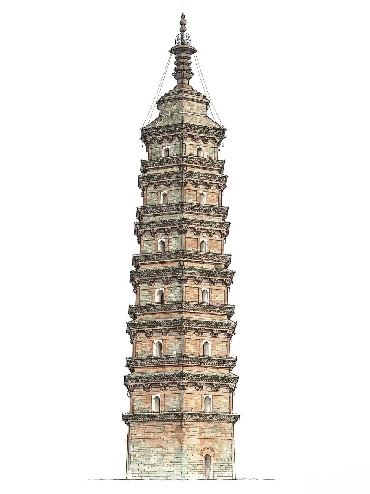
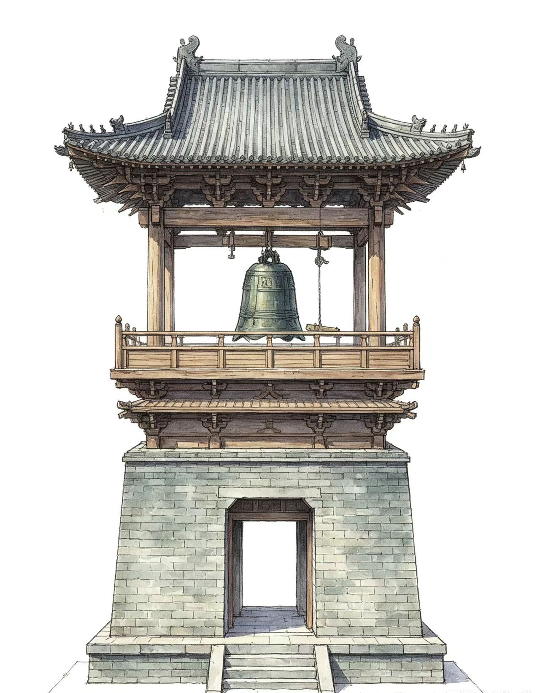
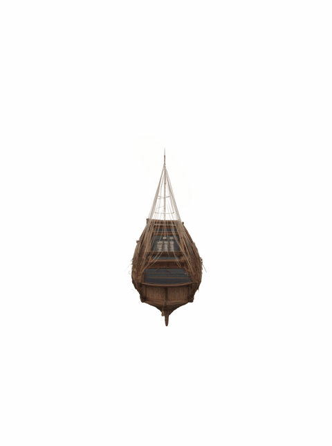
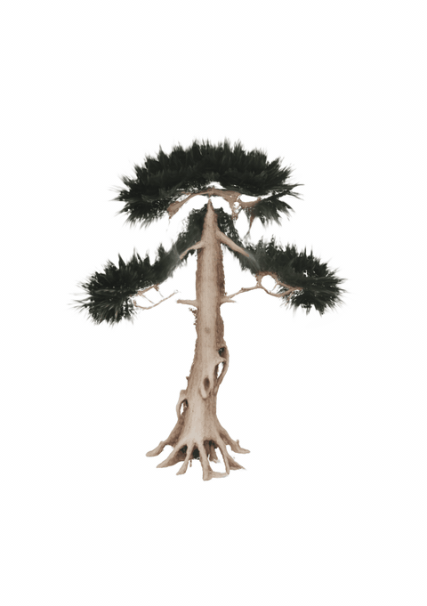
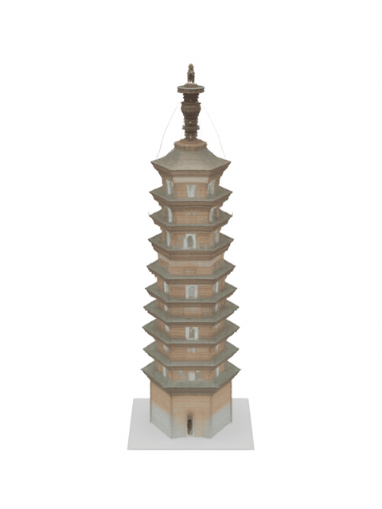
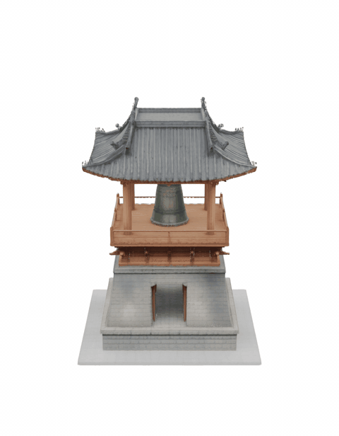
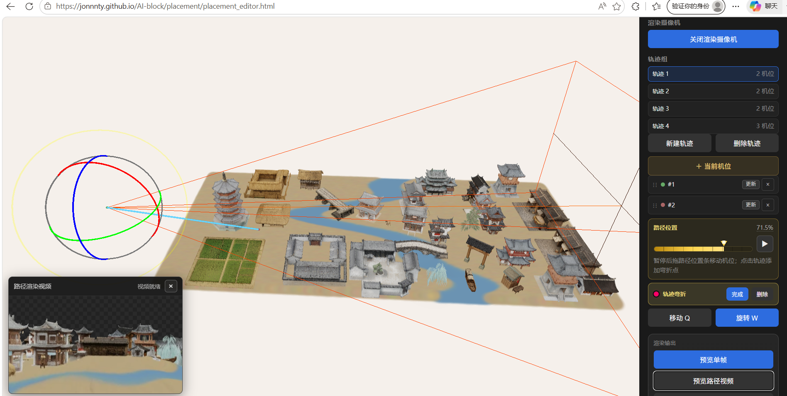

# AI-block

AI 场景创建和视频生成（持续扩展中）。

## 模块

| 模块 | 说明 | 在线链接 |
|------|------|----------|
| **placement** | Gaussian Splat 模型摆放 + 相机轨迹 | [打开场景编辑器](https://jonnnty.github.io/AI-block/placement/placement_editor.html) |

#### 模型生成建议

场景编辑器使用的是 **3D Gaussian Splat** 模型（`.ply`）。可按下面流程自己生成：

1. **AI 生图**：用任意 AI 绘图工具生成想要的物品，尽量放在 **纯白背景** 上，主体清晰、少遮挡。
2. **转 3D 高斯**：用 Meta 的 [SAM 3D Objects](https://github.com/facebookresearch/sam-3d-objects) 从图片（及 mask）重建 3D，并导出 PLY：

<table>
  <tr>
    <td align="center"><b>图片</b></td>
    <td align="center"></td>
    <td align="center"></td>
    <td align="center"></td>
    <td align="center"></td>
  </tr>
  <tr>
    <td align="center"><b>转化生成的模型</b></td>
    <td align="center"></td>
    <td align="center"></td>
    <td align="center"></td>
    <td align="center"></td>
  </tr>
</table>

3. **导入场景编辑器**：把生成的 `.ply` 拖入 [场景编辑器](https://jonnnty.github.io/AI-block/placement/placement_editor.html) 即可摆放。

#### 渲染画面润色

渲染出来的视频画面可以使用 [Bernini](https://github.com/bytedance/Bernini) 的 **Bernini-R 1.3B** 进行环境渲染：

<table>
  <tr>
    <td align="center"></td>
    <td align="center"><b>雪天</b></td>
    <td align="center"><b>雨天</b></td>
    <td align="center"><b>夜景</b></td>
  </tr>
  <tr>
    <td align="center"><b>渲染画面</b></td>
    <td align="center"></td>
    <td align="center"></td>
    <td align="center"></td>
  </tr>
  <tr>
    <td align="center"><b>Bernini-R 1.3B 润色后</b></td>
    <td align="center"></td>
    <td align="center"></td>
    <td align="center"></td>
  </tr>
</table>
